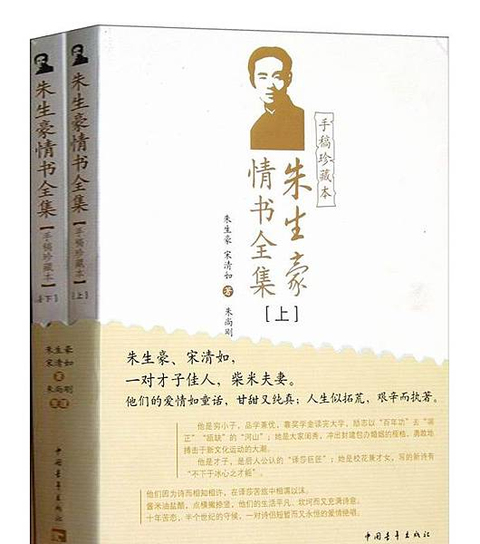

<a id = "TOP"></a>

>- [欢喜](#欢喜)
- [调皮](#调皮)
- [撒娇](#撒娇)
- [示爱](#示爱)
- [痛苦](#痛苦)
- [建议](#建议)
- [浪漫](#浪漫)
- [关心](#关心)
- [思念](#思念)
- [日常](#日常)
- [评论](#评论)
- [叙事](#叙事)
- [卑微](#卑微)
- [宋清如](#宋清如)
- [朱生豪](#朱生豪)
- [时局](#时局)
- [Reference](#Reference)

# 欢喜

>1. 今天起来看见太阳光，心里有一点高兴。山中的雨是会给人诗一样的寂寞的，都市的雨只是给人抑塞而已，连相思都变成绝望的痛苦了。
- 年初一的夜里，我是怎样高兴得整夜不睡，天气恶劣怎样反而使我欢喜，因为我可以向你证明我的一片诚心。
- 想把你抱起来高高的丢到天上去。醒来觉得甚是爱你。这两天我很快活，而且骄傲。
- 今天我工作效率很好，走路时脚步也有点飘飘然，想要蹿蹿跳跳似的，天气又凉得可爱，心里充满了各种快乐的梦想。


# 调皮

>1. 不许你再叫我朱先生，否则我要从字典上查出世界上最肉麻的称呼来称呼你。特此警告。
- 你的来信如同续命汤一样，今天我算是活转来了，但明天我又要死去四分之一，后天又将成为半死半活的状态，再后天死去四分之三，再后天死去八分之七……等等，直至你再来信，如果你一直不来信，我也不会完全死完，第六天死去十六分之十五，第七天死去三十二分之三十一，第八天死去六十四分之六十三，如是等等，我的算学好不好？
- 弟怨不欲生，阿姊是否被大狼衔去了乎？
- 昨夜看小说看到二点多，今天倦得想死。我不想骂你，第一因为我倦；第二因为你叫我不要骂你；第三因为我并不比你好，不配骂你；第四即使我不倦，即使你叫我骂你，即使我配骂你，我也不愿意骂你，因为你是宝贝。
- 否则我将不写信给你了，不是因为不待你好，而是因为没有邮票。
- 心里不痛快的时候，也真想把你抓起来打一顿才好。
- 清如仁姐大人芳鉴
- 有人说你是最甜也是最可信赖的好人，你承认不承认？（那个“有人”便是我。）


# 撒娇

>1. 挨过了一个无聊的聚餐，回到斗室里剥去衣裳（我不想对你讲究无聊的礼貌，一定要衣冠端正而写信），便在纸上写上了好人两个字，这光景正像受了委屈的孩子扑到娘怀里便哇的一声哭起来一样，除了这我也想不出什么安慰自己的办法了。
- 我不要翻日历，因为它会骗我只不过是三数天，但我明明觉得有好几个月了，你不曾有信来。
- 多雨而凄凉的天气，心理上感到些空虚的压迫，我真想扑在你的怀里，求你给我一些无言的安慰。


# 示爱

>1. 我实在喜欢你那一身的诗劲儿，我爱你像爱一首诗一样。
- 只有一个冀念，能够在可能的最近再看见你，我将永远留一个深心的微笑给你，那是一切意望之花，长久的竚候里等待着开放的。
- 如果我想要做一个梦，世界是一片大的草原，山在远处，青天在顶上，溪流在足下，鸟声在树上，如睡眠的静谧，没有一个人，只有你我，在一起跳着飞着躲着捉迷藏，你允不允许？因为你不允许我做的梦，我不敢做的。我不是诗人，否则一定要做一些可爱的梦，为着你的缘故。我不能写一首世间最美的抒情诗给你，这将是我终生抱憾的事。我多么愿意自己是个诗人，只是为了你的缘故。
- 我不知道你和你的老朋友四年不见面，比之我和你四月不见面哪个更长远一些。
- 你的名字清如最好了，字面又干净，笔画又疏朗，音节又好。
- 我爱你，此外什么都不知道。
- 不骗你，我很爱你，仍旧想跟你在一起做梦。
- 不要愁老之将至，你老了一定很可爱。而且，假如你老了十岁，我当然也同样老了十岁，世界也老了十岁，上帝也老了十岁，一切都是一样。
- 梦中不识路，何以慰相思。我是怎样的爱听你说话。
- 祝你非常好，许我和你偎一偎脸颊。
- 以前我最大的野心，便是想成为你的好朋友，现在我的野心便是希望这样的友谊能继续到死时（把这称为野心，我想是一点也不过分），同时我希望自己能变好一些，使你更欢喜我。
- 我心里有歌唱，有希望，有你。
- 我爱你永远爱不完，愿蚊子不要叮你。
- 我明白我们在这世上应该找寻的是自己，不是自己以外的人，因为只有自己才能明白自己，谅解自己，我找到了你，便像是找到了我真的自己。如果没有你，即使我爱了一百个人，或有一百个人爱我，我的灵魂也仍将永远彷徨着，因为只有你才是属于我的type(52)，你是unique(53)的。我将永远永远多么的多么的欢喜你。


# 痛苦
>1. 十一年前的那天，人生的悲哀掩上了我，以至于今日。
- 越是想你，越没有梦，福薄缘悭，一至于此！昨夜好容易到将醒来时才梦见接到你一封薄如蝉翼的信，还来不及拆开看时已经醒了。
- 凄惶地上了火车，殊有死生契阔之悲，这次，怕真是最后一次来之江了。颇思沉浸六个钟头的征途于悲哀里，但旋即为车厢内的嘈杂所乱，而只剩得一个徒然的空虚之怅惘了。八点多钟回到亭子间里，人平安。你会不会以为我这次又是多事的无聊？我愧不能带给你一点美好的或物，并不能使自己符合你的期望。每次给你看的一个寒伧的灵魂，我实不能不悲哀自己的无望。

# 建议

>1. 为练习写作起见，翻译是很有助于文字的技术的。假如你的英文不过于糟，不妨自己随便试试。

# 浪漫

>1. 在风雨的下午或星月的黄昏走那么一段充满着希望的欢悦的路
- 昨夜一夜天在听着雨声中度过，要是我们两人一同在雨声里做梦，那境界是如何不同，或者一同在雨声里失眠，那也是何等有味。可是这雨好像永远下不住似的，夜好像永远也过不完似的，一滴一滴掉在我的灵魂上……


# 关心

>1. 不会哭吧？我很急，真想跑来瞧瞧你。
- 好好珍重，以后不许生病了。


# 思念

>1. 春天，我不忆杭州，只忆你


# 日常

>1. 在广东店里悄悄地吃了一碗叉烧蛋炒饭，便乘雨回家。今天虽是星期一，又天雨，而戏院仍满满的。
- 二月份起——


# 评论

>1. 你会不会玩麻将牌？那并不是怎样有趣的东西，有时会使你非常心烦，但一陷入方阵之后，简直无法摆脱，完全不想罢手了，因此是费时失业的东西，并且能使亲人暂时变为冤家，因赌牌而两亲家母争吵或母女不和，是最普通不过的事。如外国的纸牌之类，如果目的不是为赌钱，只是游戏而已，那不久就会厌倦的，但麻雀牌的魔力要大得多，它需要更复杂的勾心斗角，同时又要看手风牌势，讲命运，各人的个性也最能在打牌时看出来，有的是越输越吵，有的却越输越静，有的迟疑不决，有的当机立断，有的老谋深算，有的粗率卤莽，有的敢冒险，有的讲持重稳健，有的随随便便，有的心无旁骛，洋洋乎大观哉。至于等待一张需要的牌的心境，是和恋人的心境并无二致的。
- 如果欣赏诗需要天才，那么看电影岂不也要天才？对于艺术的理解力的深浅，完全资于个人的素养，依浸润的程度的深浅而定，与天才无关。正如吃冰淇淋一样，发明制冰淇淋者自然是一个天才，但晓得冰淇淋好吃的人却根本无需乎天才。第一次吃冰淇淋的时候，牙齿冷得发痛，吃了一口便不敢再吃下去，后来我却成为冰淇淋的饕餮者，这便是因为对于吃冰淇淋的素养丰富起来，而理解力也有了进步了。
- 死刑最残酷的地方不是在受刑之时，而在牵赴刑场至就刑的中间一段时期，那时罪犯经历所有恐怖的苦难。
- 想到爱国这个问题，我说爱国是一个情感的问题。国民对于国爱不爱全可以随便，不能勉强的，但因为个人是整个国家的一分子，因此必然地他对于他的国家有一种义务，一个好国民即是能尽这种义务的人，而不一定要爱国。因为情感会驱使人们盲目，如果他的国家是一个强国，那么他会变成一个自私的帝国主义者，以征服者自命；假如他的国家是一个落后的国家，那么他会妄自尊大，抬出不值一文钱的“国粹”来自吹自捧，而压抑了进步势力的抬头。如果人人知道他的国家的不可爱，而努力使它变得可爱起来，那么这国家才有希望。中国并不缺少爱国的人，一听到闸北要有战争了，人人变成了“民族主义者”，然而他们的民族主义只能把他们赶到法租界去而已。
- Hamlet是一本深沉的剧本，充满了机智和冥想，但又是极有戏剧效果，适宜于上演的。莎士比亚的所以伟大，一个理由是因为他富有舞台上的经验，因此他的剧本没一本是沉闷而只能在书斋里阅读。譬如拿歌德的Faust(8)来说吧，尽管它是怎样伟大，终不免是一部使现代人起瞌睡之思的作品，诗的成分太多而戏剧的成分缺乏，但在莎氏的作品中，则这两个成分是同样的丰富，无论以诗人而论或戏剧家而论，他都是绝往无继。
- 读戏曲，比之读小说有趣得多，因为短篇小说太短，兴味也比较淡薄一些，长篇小说太长，读者的兴味有时要中断，但戏剧，比如说五幕的一本，那就不嫌太长，不嫌太短。因为是戏剧的缘故，故事的布置必然是更加紧密，个性的刻划必然是更加显明，剧作者必然希望观众的注意的集中不懈。因此，所谓“戏剧的”一语，必然含有“强烈的”、“反平铺直叙的”的意味。
- 我说鲁迅的死，还不及阮玲玉的死更有意义。因为就作品的影响而论，纵的方面固然若干年后没有人再会记得阮玲玉，但鲁迅的著作，是不是能永久成为中国文学里不朽的classic，也还是一个疑问，他的杂文固然绝少保留的价值（在“现今”也许还有用），以薄薄的两本《呐喊》和《彷徨》来说，其价值也不过是新文学草创时期的两块纪程碑；《阿Q正传》（在《呐喊》中不是最出色的一篇）虽然搔着了中国人的痛处，但其性质只是一篇satire，如认为小说是太草率了。至于横的方面，鲁迅的读者就不及阮玲玉的观众之广入社会各阶层，对于一般大众的生活思想，阮玲玉的影响无疑要比鲁迅的影响大得多。
- 对于《威尼斯商人》的迄今仍未完工，真是性急得了不得，可是没法子，只好让它慢吞吞地进行着。无论如何，过了这个星期日一定可以寄给你看一遍，比起梁实秋来，我的译文是要漂亮得多的。
- 有经验的译人，如果他是中英文两方面都能运用自如的话，一定明白由英译中比由中译英要难得多。原因是，中文句子的构造简单，不难译成简单的英文句子，英文句子的构造复杂，要是老实翻起来，一定是噜苏累赘拖沓纠缠麻烦头痛看不懂，多分是不能译，除非你胆敢删削。
- 七日一星期这种制度实在不大好，最好工作六星期，休息一星期，否则时间过去得太快，星期三觉得一星期才开始，星期四就觉得一星期又快完了，连透口气儿的工夫都没有，稍为偷了一下懒，一大段的时间早已飞了去。


# 叙事

>1. 真的是满城风雨，外面冷得令人发抖，雨不单是从天上落下来，还要从地面上刮起来，全身淋湿在雨中（伞当然是撑着的），风可以把你吹倒，真令人兴奋。回到斗室中，那么温暖！无月的中秋是可爱的。


# 卑微

>1. 风雨如晦，天地失色，我心寂寞，盖欲哭焉。今天虽然盼得你的信，可是读了等于不读，反而更觉肚子饿，连信封才七十字耳，吝啬哉！
- 写一封信在你不过是绞去十分之一点的脑汁，用去两滴眼泪那么多的墨水，一张白白的信纸，一个和你走起路来的姿势一样方方正正的信封，费了五分钟那么宝贵的时间，贴上五分大洋吾党总理的邮票，可是却免得我食不甘味，寝不安席，无心工作，厌世悲观，一会儿恨你，一会儿体谅你，一会儿发誓不再爱你，一会儿发誓无论你怎样待我不好，我总死心眼儿爱你，一会儿在想象里把你打了一顿，一会儿在想象里让你把我打了一顿，十足地神经错乱，肉麻而且可笑。你瞧，你何必一定要我发傻劲呢？就是你要证明你自己的不好，也有别的方法，何必不写信？因此，一、二、三，快写吧。
- 女皇陛下：我希望你快些写信给我，好让我放心你已不恼我了。至少也得告诉我一声十个月不写信是从哪一天算起，好让我自即日起伫颈期待它的满期。我很欣幸你恼我得并不彻底，否则你会说永远不再写信给我的。既然不是彻底的恼，那么最好还是索性不恼，因为恕人者最快乐，而我也将感恩不尽，永远纪念你的好处。我不愿说保证以后不再有这种事发生，因为也许为了空间的时间的、心理的生理的、物理的化学的、形而上的形而下的、物质的精神的、个人的社会的种种关系，仍旧会身难自主。
- 为了对你表示最大的忠诚与感激起见，总将竭力避免此等事件之再发生，倘不幸而力有未逮，则惟有等待挨骂一顿，之后复为君臣如初，此则私心之所企祷而无任拜悚者也。
- 心里很空虚，没处走走，毫无办法，只好写信。我知道要是我少写些信，少说些我爱你，你一定会比较欢喜我些。如今我是抵庄着不被你欢喜的了。
- 如果你不喜欢我说“我待你好”一类的肉麻话，这回我就不说。
- 今天中饭气得吃了三碗，肚子胀得很，放了工还要去狠狠吃东西，谁教宋清如不给信我？我告诉你我爱宋清如，随你说我肉麻，说我无聊，说我臭，说我是猪猡驴子猢狲夜叉小鬼都不相干。


# 宋清如

>1. 生豪周年祭（宋清如）：如似梦非梦地，这一幕太凄凉，太悲惨的事实，竟已过去有一年了。谁说时间的老人，会医治沉重的创伤，我不信这悲痛的印象，会有一天在我记忆里淡忘。一年，整整的一年，我在雪花的纷飞时，在红杏的灼灼中，在滔滔的淫雨中不断地悲悼着感伤着，现在又是秋尽入冬了。季节过去得太慢也太快，但谁又能把失去的生命重新捡回来呢？
- 湖州有没有什么可以玩玩的地方，人家陪不陪你出去走走？除国文外，你还教些什么功课？
- 民德是不是教会学校？大概是的，我想。我顶不欢喜教会里的女人。
- 我记住你的阴历生日是六月十八，阳历生日是七月三十一(3)，错不错？
- 二周年祭生豪(宋清如): 谁都没有向我撒谎，这又是冬的季节了。在西北风的呼号中，悸栗的不只是衰草枯木，而使我痉挛的，却不是严冬的淫威，而是痛苦的记忆。虽则今年的春天，也曾开过惨红的花，装点这千疮百孔的地面；秋天也曾有过灰白的月亮，照亮惊悸的梦寐。但季节的推流，毕竟没法掩饰过去的创伤。阴霾的风，阴霾的云，是大雪纷飞的预兆，这不是在你逝世之后，又将过着第二个冬天了吗？我悲哀，我战栗，但是我却挤不出泪水，洒向你的灵前，也拉不开喉咙，向你哭诉着委屈。在你逝世两周年后的今天，难道我对于你的哀感竟会如此淡漠了吗？也许人家会作如此看法，但是，生豪，除了你，我不想人家知道我，也不愿人家知道我。你是我这世上唯一的知己，唯一的信仰。你的死亡，带走了我的快乐，也带走了我的悲哀。人间那有比眼睁睁看着自己最亲爱的人由病痛而致绝命时那样更惨痛的事！痛苦撕毁了我的灵魂，煎干了我的眼泪。活着的不再是我自己，只似烧残了的灰烬，枯竭了的古泉，再爆不起火花，漾不起漪涟。不是吗，亲爱的朋友，我将再对什么事感到兴趣，也何必向人求取同情呢？
- 我想望有一块较为近便的土地，能使你和父母安葬在一起，清风明月之夜，松下泉畔好让诗灵踯躅低吟。但是，买地固然力难即办，安葬又谈何容易，徒然使我心头压着重石，也无法向你告慰，惟有把一切付之命运，让事实为我见证了。


# 朱生豪

>1. 没有什么可吃的东西，刚才吃了半听果酱。
- 我每天早晨伤风五分钟。
- 我非常怨，左半的胸背上生了许多颗粒状的东西，挤之出水，其名不知，没有什么痛楚，也不发痒，可是很难受，人好像分为两半，右半身健好如恒，左半身则又乏力又受罪，看样子好像得去请教医生，可是没有妈妈陪着，很胆怯，怎么办？【注释：带状疱疹？】
- 我相信我后天一定会好了，这回害的是“神经性匍行疹”（不知有没有写错），搽了点凡士林，渐渐在瘪下去。最苦的是左臂，因为胁下也生着，酸麻得抬不起又放不下，无论坐着立着走着睡着，总归不知道安放在什么地方好，现在已好多了。事情仍旧每天在做着。
- 回家很没趣味。兄弟一个失业，拉长了面孔，一个又吐出过一点血。长者们逼我快娶亲，你肯不肯嫁我？【注释：朱生豪由于肺结核而过世，难不成他的兄弟也有此病？】
- 买了四条冰棒回家吃了。一个下午及一个晚上，抄了一万多字，然后看一小时杂志，两点钟睡觉。斯乃又一个星期日。
- 买了四支棒冰，吃了一个爽快。赤豆棒冰好像是今年才有起的，味道很好，可是吃过了冰，嘴里总会渴起来，水壶里又没有冲水，很苦。


# 时局

>1. 昨天下午一点半跑出门，心想《雷梦娜》是一定看不成的了，于是到北四川路逛书摊和看日本兵。日本兵的一个特色就是样子怪可怜相的，一点没有赳赳武夫的气概，中国兵至少在神气上要比较体面得多。他们不高的身材擎着枪呆若木鸡地立着，脸上没有一点表情，而对面的中国警察则颇有悠游不迫之慨。
- 我现在不希望开战，因为我不希望生活中有任何变化，能够心如止水，我这工作才有完成的可能。日子


# Reference
>1. 《朱生豪情书全集》中国青年出版社 (Kindle Edition). 

# <center>[TOP](#TOP)</center>


```python

```
